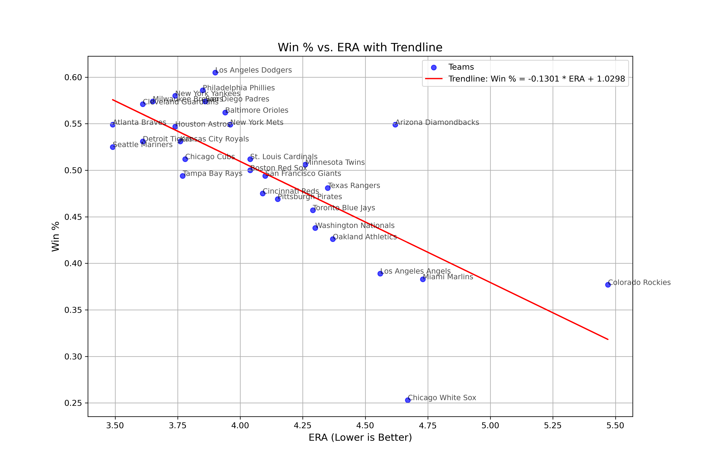

# MLBpublic
Public datasets and models for the MLB

Various python files and png files of the raw data file for team stats for 2024 MLB season

# MLB Statistics Analysis

## Win % vs. HR (Home Runs)

## Win % vs. AVG (Batting Average)

## Win % vs. BB (Walks)

## Win % vs. ERA (Earned Run Average)

## Win % vs. WHIP (Walks, Hits, Innings Pitched)
